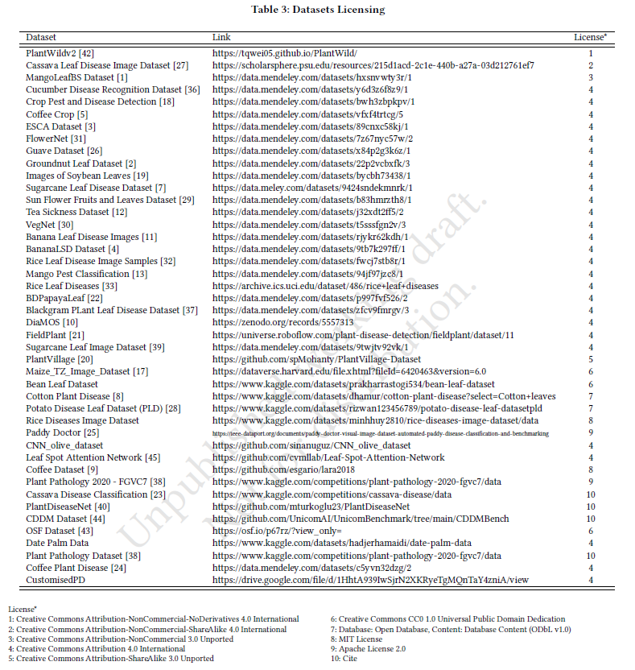
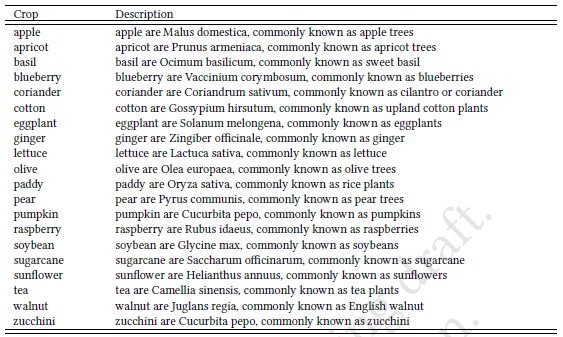
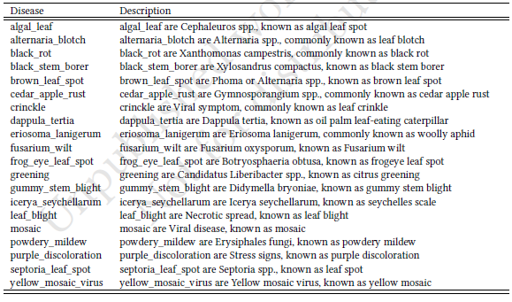

# Deep-Plant-Disease Dataset Is All You Need for Plant Disease Identification

The full dataset and textual description will be available upon publication.

The supplementary material is available [here](supplementary_materials.pdf) 

The sample images are available [here](/sample_images/) 

testing

The table above show all sources with licenses of our proposed Deep-Plant-Disease dataset.

The table above show the example of botanical taxonomy textual descriptions for crop.

The table above show the example of botanical taxonomy textual descriptions for disease.

